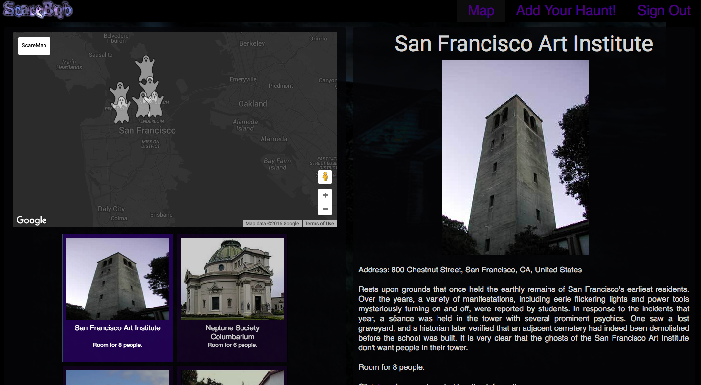

# SCAREBNB

## Locations
ScareBnb is a web application inspired by AirBnb, built using Ruby on Rails and React.js.  ScareBnb allows users to search available locations using the Google Maps API, and view information about each location.  Users can also add locations to the map, which uses GeoLocation and GeoSuggestion for a smooth transition between user input and marker placement.

## Authentication
Authentication features include Sign In and Sign Up functionality, with password hashing through BCrypt.  A demo Sign In is provided for quick viewing access.

## API Integration
A lot of people have been asking about how I put together the ScareMap, with the dark styling and the ghosts.  I actually ended up using the Google Maps API Styled Map Wizard (google it) to set everything up, then copied the CSS directly.  The "name" option labels the map on the top-left.  Changing the markers on the map to ghosts was as simple as changing the "icon" property of the marker upon creation.  You do need to do this each time a marker is made however, as I haven't found a way to set the icon globally on the map (let me know if you do).

For the map on the Location Form I used Geosuggest to allow the user to input their address.  This also allows you to choose a "center" of the location search, so it'll focus on the Bay Area before suggesting other areas.

All in all it was fairly straightforward process, and the documentation given by Google is very thorough.  Working with this API has given me a million creative ways to implement it pretty much anywhere, simply because of how easily adaptable it is.  I would highly suggest integrating the Google Maps API into any project, if only to see for yourself what you can do with it.

# Upcoming Features
* Search locations with text input
* Allow users to see requests for their location
* Set reminders on bookings/requests
